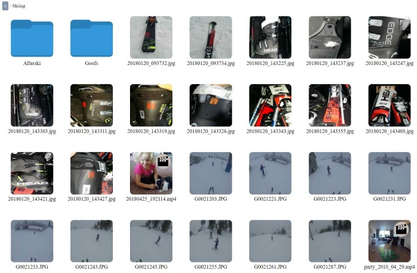
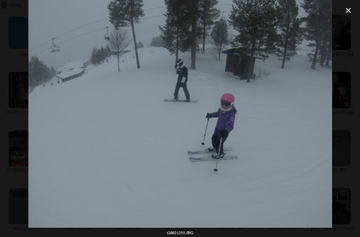

# MediaWEB - Access your photos and videos over Internet

MediaWeb is a small self-contained web server software to enable you to access your photos and videos over the Internet in your WEB browser.

The main design goal of MediaWEB is that no additional dependencies shall be needed, such as a script engine (Java, Python, Perl, Ruby etc.), or server (Apache, NGINX, IIS etc.) or database (MySQL, sqlite etc.). The only files required to run MediaWEB are:

* The mediaweb executable
* A configuration file, mediaweb.conf

Optional dependencies are:

* [ffmpeg](https://www.ffmpeg.org/) for video thumbnail support

No additional stuff, such as dockers and similar is required. 

MediaWEB is well suited to run on small platforms such as Raspberry Pi, Banana Pi, ROCK64 and similar. It is still very fast and can be used with advantage on PC:s running Windows, Linux or Mac OS.

## Content

- [Screenshots](#screenshots)
- [Features](#features)
- [Download and install Linux](#download-and-install-linux)
- [Download and install on Windows](#download-and-install-on-windows)
- [Build from source on any platform](#build-from-source-on-any-platform)
- [Configuration guide](#configuration-guide)
- [Future improvements](#future-improvements)
- [Author and license](#author-and-license)
- [FAQ](FAQ.md)

## Screenshots

Browse your media:

View your images and play your videos:

Swipe (mouse or mobile touch) to switch between images/videos. It is also possible to use keyboard; left arrow key (previous image), right (next image), page up (first image) and page down (last image):

Multi-touch pitch to zoom images:

Interface suited for mobile devices:

## Features

* Simple WEB GUI for viewing your images and videos both on your PC and on your mobile phone
* Thumbnail support for images and videos, primary by reading of EXIF thumbnail if it exist, otherwise thumbnails will be created and stored in a thumbnail cache. Video thumbnails requires [ffmpeg](https://www.ffmpeg.org/) to be installed
* Automatic rotation JPEG images when needed (based on EXIF information)
* Generate thumbnails on the fly, on start-up and/or when new files are added to the media directory
* **NEW!** Automatically resize images to reduce network bandwidth and get a smoother navigation at client
* Optional authentication with username and password

## Download and install Linux

For PC x64 based Linux write following in a shell:

    export MW_ARCH=x64

For ARM based Linux on for example Raspberry Pi, Banana Pi, ROCK64 etc:

    export MW_ARCH=arm

Then run following for all Linux platforms:

    mkdir ~/mediaweb
    cd ~/mediaweb
    curl -s https://api.github.com/repos/midstar/mediaweb/releases/latest \
    | grep browser_download_url \
    | grep "mediaweb_linux_${MW_ARCH}.tar.gz" \
    | cut -d : -f 2,3 \
    | tr -d \" \
    | wget -qi -
     tar xvzf mediaweb_linux_${MW_ARCH}.tar.gz
     sudo sh service.sh install

Follow the instructions in the service.sh script.

For video thumbnail support, install ffmpeg:

    sudo apt-get install ffmpeg

To perform additional configuration, edit:

    sudo vi /etc/mediaweb.conf

And then restart the MediaWEB service with:

    sudo systemctl restart mediaweb

To uninstall MediaWEB run:

    cd ~/mediaweb
    sudo sh service.sh uninstall

Also, checkout the [Configuration guide](#configuration-guide) and [FAQ](FAQ.md).

## Download and install on Windows

Download mediaweb_windows_x64_setup.exe [here on GitHub](https://github.com/midstar/mediaweb/releases).

Run the installer and follow the instructions.

To modify changes just edit mediaweb.conf in the installation directory and restart the mediaweb
service in task manager.

You need to install [ffmpeg](https://www.ffmpeg.org/) separately and put ffmpeg into your PATH to get video thumbnail support.

Also, checkout the [Configuration guide](#configuration-guide) and [FAQ](FAQ.md).

## Build from source on any platform

To build from source on any platform you need to:

* Install Golang 
* Set the GOPATH environment variable
* Add the bin folder within your GOPATH to your PATH environment variable ($GOPATH/bin)

On Windows execute (from cmd.exe):

    go get github.com/midstar/mediaweb
    cd %GOPATH%\src\github.com\midstar\mediaweb
    scripts\install_deps.bat
    scripts\build.bat

On Linux/Mac execute (from a shell):

    go get github.com/midstar/mediaweb
    cd $GOPATH/src/github.com/midstar/mediaweb
    sh scripts/install_deps.sh
    sh scripts/build.sh

The mediaweb executable and an example configuration file will be in 
$GOPATH/src/github.com/midstar/mediaweb. Edit the configuration file
and then run the mediaweb executable.

To install as a Windows service start cmd.exe in administrator mode and run:

    scripts\service.bat install

On Linux platforms execute following to install MediaWEB as a service:

    sudo sh scripts/service.sh install

## Configuration guide

See [mediaweb.conf](configs/mediaweb.conf) for the available configuration parameters.

The most important configuration parameter is *mediapath* which points out the 
directory of your media. 

Your might also want to change the *port* configuration parameter.

### Increase performance with preview / resized images

By default the server will provide the full images to the client (WEB browser).
This is generally not an issue if you view your images over your home network, but
over Internet or a mobile network it might take very long time to load the images.
Also, since the images are large, the user interface might feel slow and unresponsive
particulary in mobile web browsers.

To fix these issues, at the cost of more caching storage space, MediaWEB can reduce the
size / resolution and put the resized images in cache. The resizing procedure will
take quite much time, especially for SBCs. Therefore you should configure MediaWEB
to generate the previews at startup and when new files are added to your media
directory:

    enablethumbcache = on
    genthumbsonstartup = on
    genthumbsonadd = on
    enablepreview = on
    genpreviewonstartup = on
    genpreviewonadd = on

Count with ~300 - 800 KB per image, so you need to secure that the cache folder pointed
out with the *cachepath* has enough disk space.

Also, if you have many images and are running on an SBC it might take very, very long
time the first time the images are resized. Count with several days.

## Future improvements

* Add support for TLS/SSL

## Author and license

This application is written by Joel Midstjärna and is licensed under the MIT License.